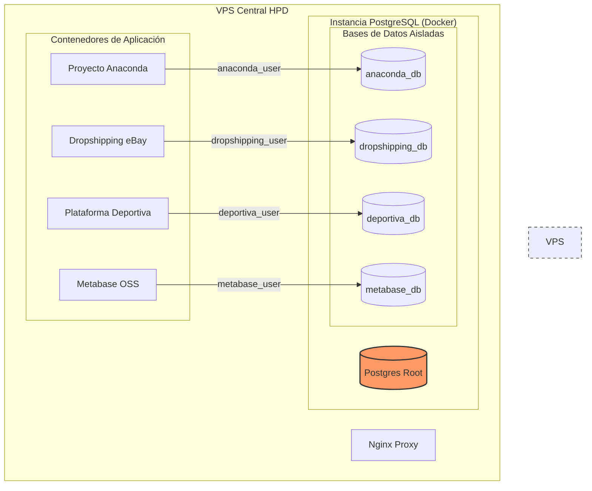
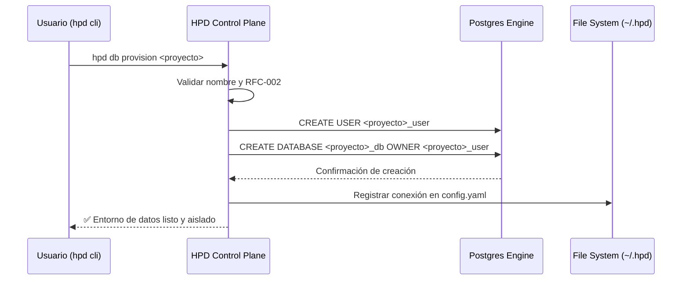

# 📊 Arquitectura Visual HPD (RFC-002)

Este documento complementa la **RFC-002** con diagramas esquemáticos y de flujo para visualizar el aislamiento y la gestión de datos.

## 1. Estructura de Aislamiento (Esquemático)
Muestra cómo conviven los proyectos en un mismo VPS pero con fronteras de datos infranqueables.



## 2. Flujo de Provisión (`hpd db provision`)
Muestra el proceso creativo de dar vida a un nuevo proyecto en el ecosistema.



## 3. Flujo de Backup Aislado (`hpd db backup`)
Garantiza que un fallo en el respaldo de un proyecto no afecte la disponibilidad de los demás.

```mermaid
graph LR
    subgraph "Operación de Respaldo"
        CMD[hpd db backup] --> Target{¿Qué proyecto?}
        Target -- "Anaconda" --> Dump1[pg_dump anaconda_db]
        Target -- "Dropshipping" --> Dump2[pg_dump dropshipping_db]
    end

    Dump1 --> S3[(Backups S3 / Local)]
    Dump2 --> S3

    note right of Dump1: Solo extrae datos de Anaconda
    note right of Dump2: No toca anaconda_db ni deportiva_db
```

---
*Diagramas generados para soporte de salud mental y claridad técnica del equipo HPD.*
